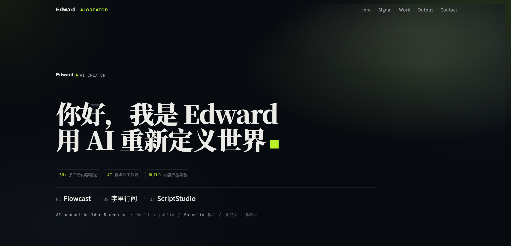

# Edward's Personal Website

个人网站 —— 用 [Astro](https://astro.build) 构建的静态站点，编辑向排版、系统化设计语言。

**线上地址**：https://www.edwardai.me



## 技术栈

- **Astro 5**（静态输出，`output: 'static'`），无客户端框架，全站零 JS 运行时（除个别内联脚本）
- 内容用 Astro Content Collections 管理（`src/content.config.ts`），Markdown 驱动
- 原生 CSS + CSS 变量（无 Tailwind），设计令牌集中在 `src/styles/tokens.css`
- 字体自托管：Archivo Variable / JetBrains Mono Variable / Noto Sans SC / Noto Serif SC
- 图片走 Astro 内置图片优化（`image()` schema，自动转 webp/avif）

## 项目结构

```
src/
  content/
    projects/    # 精选项目，一篇一个 Markdown（首页作品集读取）
  content.config.ts  # Content Collections schema
  data/site.ts   # 站点文案真源：身份、导航、经历、联系方式
  assets/         # 项目封面图 / 联系方式图片
  components/astro/
  layouts/
  pages/          # 单页站点：/ 和 404
docs/             # 设计思路（设计方案 + 落地后的关键决策）
```

## 本地开发

```bash
npm install
npm run dev       # http://localhost:4321
npm run check     # astro check，类型 + 内容 schema 校验
npm run build     # 产出静态文件到 dist/
npm run preview   # 本地预览 build 产物
```
